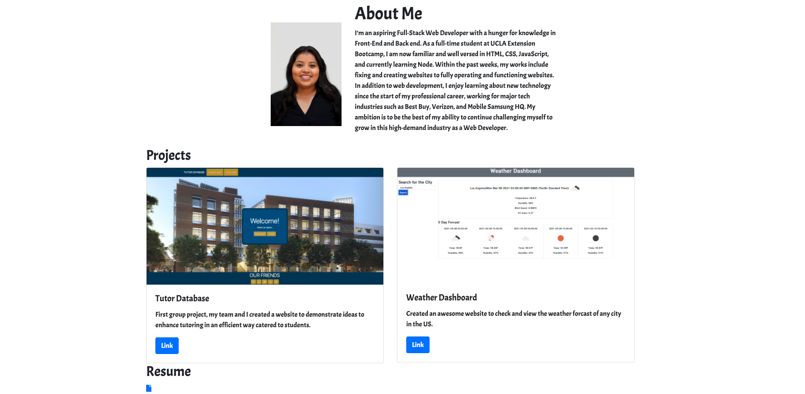

# portfolio_

Description-
The website is a portfolio of my work history.
Sections included are:

- Home
- About Me
- Projects 
- Resume
- Additional Links

[Portfolio Website](https://ginavargas1.github.io/portfolio_/)

The About Me section provides information about my current experience as a student. Projects include my first group project and the second one is a weather dashboard I did for homework. The following section is a link to my resume as a pdf file (just click the file icon and you will be directed to my resume), which also includes my contact info. The last section is the footer with two icons, LinkedIn and GitHub, when you click the icons you will be direct to the my profile website.

